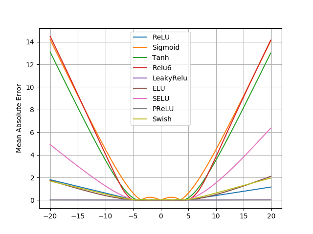

# NALU
Implementation of Neural Arithmetic Logic Units (https://arxiv.org/pdf/1808.00508.pdf)

## Notes

### Differences between this implementation and the original one in the paper
* Use two separate weight matrices for the adder and the multiplier
* The gate is independent of the input

See [nalu.py](nalu.py) for more details. I found these modifications can help the performance on the simple function learning task.

## Exp 1: Fail to Extrapolate

```bash
python3 failure.py
```

#### Results

* Most non linear activation functions fail to exprapolate except that PReLU can learn to be highly linear.



## Exp 2: Simple Function Learning
```bash
python3 learn_function.py
```

### Interpolation
* RMSE (normalized to a random baseline)

|     |ReLU|NALU|NAC|
| --- |  --- | --- | --- |
|a + b|0.00|0.02|0.00|
|a - b|0.03|0.13|0.00|
|a x b|1.80|0.01|13.44|
|a / b|0.93|0.03|1.82|
|a ^ 2|3.61|0.00|20.63|
|sqrt(a)|0.60|0.05|2.59|

### Extrapolation
* RMSE (normalized to a random baseline)

|     |ReLU|NALU|NAC|
| --- |  --- | --- | --- |
|a + b|0.00|0.36|0.00|
|a - b|58.85|0.12|0.00|
|a x b|57.19|0.01|75.70|
|a / b|3.25|0.11|22.64|
|a ^ 2|57.70|0.00|76.62|
|sqrt(a)|16.98|0.51|62.17|

